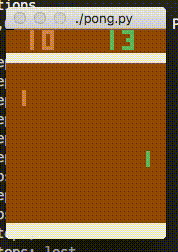

# TensorFlow reinforcement learning Pong agent

A Pong AI trained using policy gradients, implemented using TensorFlow and
OpenAI gym, based on Andrej Karpathy's [Deep Reinforcement Learning: Pong from
Pixels](http://karpathy.github.io/2016/05/31/rl/).

After 7,000 episodes of training, the result looks like:

## Usage

First, install OpenAI Gym and TensorFlow.

Run without any arguments to train the AI from scratch. Checkpoints will be
saved every so often (see `--checkpoint_every_n_episodes`).

Run with `--load_checkpoint --render` to see how an AI trained on ~8,000 episode
plays.

## Vocabulary

* 'Round': one match, in which one player gains a point
* 'Episode': a set of rounds that make up one game (usually around 20 or so -
  I'm not sure what logic the game uses to decide this)

## Training Time

* It takes about 500 episodes to see whether the agent is improving or not
* It takes about 7,000 episodes to get to a stage where the agent is winning
  half and losing half of the rounds

## Changes from Andrej's Code

* Andrej calculates gradients for each episode, accumulates them over a batch
  size of 10 episodes, and then applies them all in one go. I think this is
  based on a recommendation in [Asynchronous Methods for Deep Reinforcement
  Learning](https://arxiv.org/pdf/1602.01783.pdf). It looked like this was going
  to be a pain to do in TensorFlow, though, (see e.g.
  <http://stackoverflow.com/q/37710974>), so here we just use a batch size of
  one episode.
* Andrej uses RMSProp, but here we use Adam. (RMSProp wouldn't work - the AI
  would never improved - and I was never able to figure out why.)

## Lessons Learned

When you have a hypothesis that you want to test, think deliberately about what
the _cheapest_ way to test it is.

For example, for a while things weren't working, and while debugging I noticed
that Andrej's code initialises his RMSProp gradient history with zeros, while
TensorFlow initialises with ones. I hypothesised that this was a key factor, and
the test I came up with was to compile a custom version of TensorFlow with
RMSProp initialised using zeros. It later occurred to me that a much cheaper
test would have been to just change Andrej's code to initialise with ones
instead.

Acknowledging explicitly to yourself when you've got a hypothesis you want to
test rather than just randomly testing stuff out in a state of flow may help
with this.
